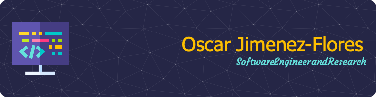

# Bienvenido a mi página de Github!

¡Hola! Soy el Dr. Ing. Oscar J. Jimenez Flores, un entusiasta ingeniero de software con especialidad en DevOps, Inteligencia Artificial e Investigación Científica. Con más de 17 años de experiencia en el mundo de las tecnologías de la información y estoy emocionado de compartir contigo mis proyectos y contribuciones.

## Sobre mí

Soy un profesional apasionado por el desarrollo de software y la implementación de prácticas DevOps para optimizar procesos. Mi experiencia también se extiende al desarrollo de software, inteligencia artificial y la investigación científica.

## Proyectos Destacados

Aquí encontrarás una colección de proyectos que representan mi trayectoria y dedicación. Cada línea de código refleja mi compromiso con la excelencia y la búsqueda constante de la innovación.

## Contacto

Si tienes ideas, propuestas de colaboración o simplemente quieres intercambiar experiencias, no dudes en contactarme. Gracias por visitar y ser parte de esta comunidad.

Saludos,
Dr. Ing. Oscar J. Jimenez Flores

## My favorite tools and technologies ⚙️

> Herramientas y tecnologías con las que he trabajado y en las que estoy interesado.

<table>
  <tr>
    <td align="center" width="96">
        
       C#
    </td>
    <td align="center" width="96">
      
       Python
    </td>
    <td align="center" width="96">
        
       Javascript
    </td>
    <td align="center" width="96">
        
       AWS
    </td>
       <td align="center" width="96">
        
       Swift
    </td>
       <td align="center" width="96">
        
       Github
    </td>
          <td align="center" width="96">
        
       Rest API
    </td>
          <td align="center" width="96">
        
       Docker
    </td>
    <td align="center" width="96">
        
       kubernetes
    </td>
  </tr>
  <tr>
    <td align="center" width="96">
        
       Android Studio
    </td>
    <td align="center"  width="96">
        
       GitLab
    </td>
    <td align="center"  width="96">
        
       Azure
    </td>
    <td align="center" width="96">
        
       CSS
    </td>
    <td align="center"  width="96">
        
       Bootstrap
    </td>
    <td align="center" width="96">
        
       Tailwind
    </td>
        <td align="center" width="96">
        
       Ansible
    </td>
        <td align="center" width="96">
        
       PostgreSQL
    </td>
            <td align="center" width="96">
        
       ASP.NET
    </td>
  </tr>
   <tr>
    <td align="center" width="96">
        
       Redis
    </td>
        <td align="center" width="96">
        
       Postman
    </td>
            <td align="center" width="96">
        
       Selenium
    </td>
    <td align="center" width="96">
        
       Dart
    </td>
    <td align="center" width="96">
        
       RabbitMQ
    </td>
    <td align="center" width="96">
        
       Jenkins
    </td>
    <td align="center" width="96">
        
       Visual Studio
    </td>
    <td align="center" width="96">
        
       Vscode
    </td>
    <td align="center" width="96">
        
       Pytest
    </td>
  </tr>
 <tr>
 </tr>
</table>